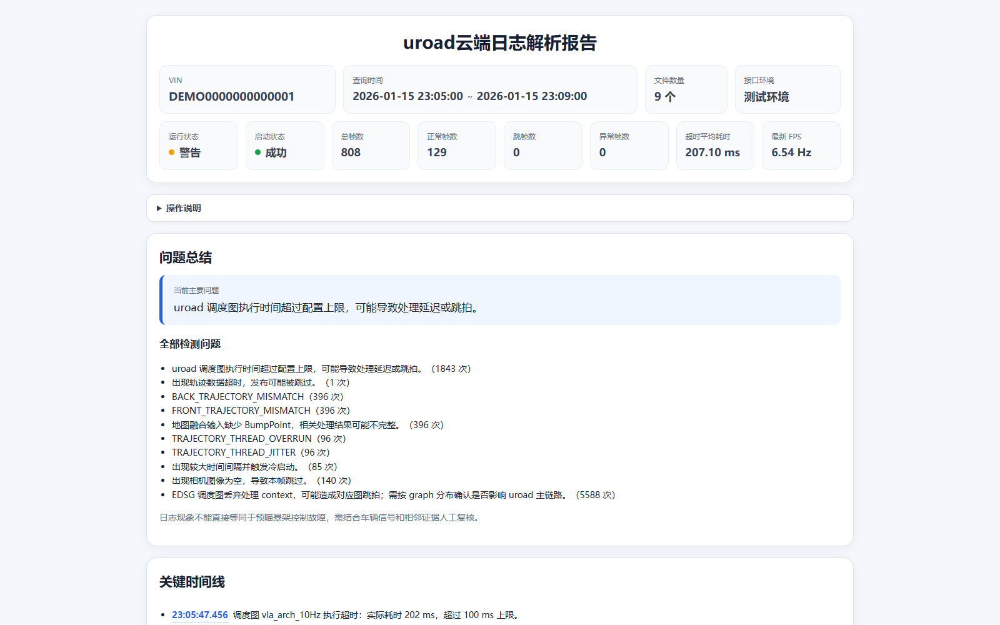

<p align="center"><sub>APPLICATION ENGINEERING · VEHICLE TELEMETRY</sub></p>

<h1 align="center">Uroad Log Analyzer</h1>

<p align="center">
  将 VIN 与时间范围转化为可追溯的 uroad / CAN 联合诊断证据，并交付为可离线打开的交互式 HTML 报告。
</p>

<p align="center">
  
  
  
  
</p>

<p align="center">
  <a href="docs/functional-spec.md">功能</a> ·
  <a href="docs/architecture.md">设计</a> ·
  <a href="docs/development.md">开发</a> ·
  <a href="docs/deployment.md">部署</a> ·
  <a href="docs/operations.md">运维</a> ·
  <a href="docs/troubleshooting.md">排障</a> ·
  <a href="docs/handover.md">交接</a>
</p>

<p align="center">
  
</p>

> 上图来自当前报告页面的脱敏副本，展示的是应用真实交付形态，不是概念效果图。仓库中的 VIN、日期和业务数据均为演示用途。

> **工程定位：** 这是一个应用开发与交付仓库，主线是可运行代码、测试、发布和运维闭环；需求说明服务于实现与验收，不把仓库包装成纯产品方案。

## 这个应用解决什么问题

排查一次车辆问题，往往要跨越请求理解、云端日志下载、压缩数据处理、CAN 信号核对、结论整理和附件交付。Uroad Log Analyzer 把这条链路收敛成可测试、可追踪、可恢复的应用工程：AI 负责理解和沟通，确定性代码负责数据、状态和成功判定。

<table>
  <tr>
    <td width="33%" valign="top"><strong>双源证据</strong><br><br>同一环境内联合分析 <code>log_fsdA_service</code> 与 <code>msg_xcu</code>，避免跨环境拼接结论。</td>
    <td width="33%" valign="top"><strong>受限执行</strong><br><br>按 15 分钟切片顺序处理，每片仅并发 uroad / CAN 两条通道，适配 8 GB 主机。</td>
    <td width="33%" valign="top"><strong>可信交付</strong><br><br>报告必须通过路径和内容校验；上传成功不等于送达，只有明确消息回执才完成。</td>
  </tr>
</table>

<p align="center">
  <code>VIN + 时间范围</code> → <code>请求归一化</code> → <code>注册 / 查重</code> → <code>uroad + CAN</code> → <code>HTML 校验</code> → <code>附件交付</code>
</p>

## 应用组成

| 单元 | 定位 | 当前状态 | 验证 |
|---|---|---|---|
| [`app/uroad-cloud-report`](app/uroad-cloud-report/) | uroad 主应用：任务、下载、分析、报告、校验与交付回写 | 当前核心基线 `2026.09.07.1` | 23 项本地测试通过 |
| [`app/supervisor`](app/supervisor/) | OpenClaw 消息的确定性路由核心 | 原型；尚不包含完整执行器和持久化 | 12 项测试通过 |
| [`app/ad-p99-analysis`](app/ad-p99-analysis/) | 双 Sheets 的 AD P99 对比能力 | 可选实验；未完成真实线上 E2E | 47 项测试通过 |

“代码测试通过”不等于“线上闭环已验收”。真实车云查询、OpenClaw 调度、飞书附件发送和多人隔离需要在获授权环境中完成验收，状态边界见[功能说明](docs/functional-spec.md)。

## 开发者快速开始

仓库使用 [uv](https://docs.astral.sh/uv/) 创建临时、隔离的验证环境，不要求把依赖安装到系统 Python。

```powershell
uv run --no-cache --with pytest --with tzdata --with openpyxl==3.1.5 python scripts/verify.py
```

只验证一个单元：

```powershell
uv run --no-cache --with pytest --with tzdata python -m pytest app/uroad-cloud-report -q
uv run --no-cache python -m unittest discover -s app/supervisor/tests -v
uv run --no-cache --with openpyxl==3.1.5 python -m unittest discover -s app/ad-p99-analysis/tests -v
```

运行真实分析前必须在安全位置创建 `app/uroad-cloud-report/settings.json`，并从 OpenClaw 工作区执行；不要在 Skill 源码目录里直接跑生产入口。完整步骤见[开发指南](docs/development.md)和[部署指南](docs/deployment.md)。

## 仓库边界

- `app/` 是唯一准备提交和维护的应用源码区。
- `docs/` 是当前设计、操作和交接事实入口。
- 本机遗留的运行数据、旧源码、历史压缩包、个人资料和真实配置由 `.gitignore` 隔离，不属于仓库。
- `app/uroad-cloud-report/vendor/` 是离线运行所需的受控原生运行时；变更必须同步校验清单和许可证。
- 公开仓库不保存公司服务域名；查询端点和下载白名单由受控部署环境注入。

## 文档地图

| 我要做什么 | 从这里开始 |
|---|---|
| 理解功能和边界 | [功能说明](docs/functional-spec.md) |
| 修改模块或接口 | [系统设计](docs/architecture.md) · [开发指南](docs/development.md) |
| 发布或回滚 | [部署指南](docs/deployment.md) · [版本来源](docs/release-provenance.md) |
| 值班、巡检和清理 | [运维手册](docs/operations.md) |
| 定位失败和恢复任务 | [故障排查](docs/troubleshooting.md) |
| 接手项目 | [交接手册](docs/handover.md) · [维护责任](MAINTAINERS.md) |

## 安全与授权

不要把 VIN、原始日志、报告、账号、令牌、公司域名或飞书身份信息提交到 Git，也不要在 Issue 中粘贴。安全边界和报告方式见 [`SECURITY.md`](SECURITY.md)。项目目前没有开源许可证；公开可见不代表允许复制、修改或再分发。
